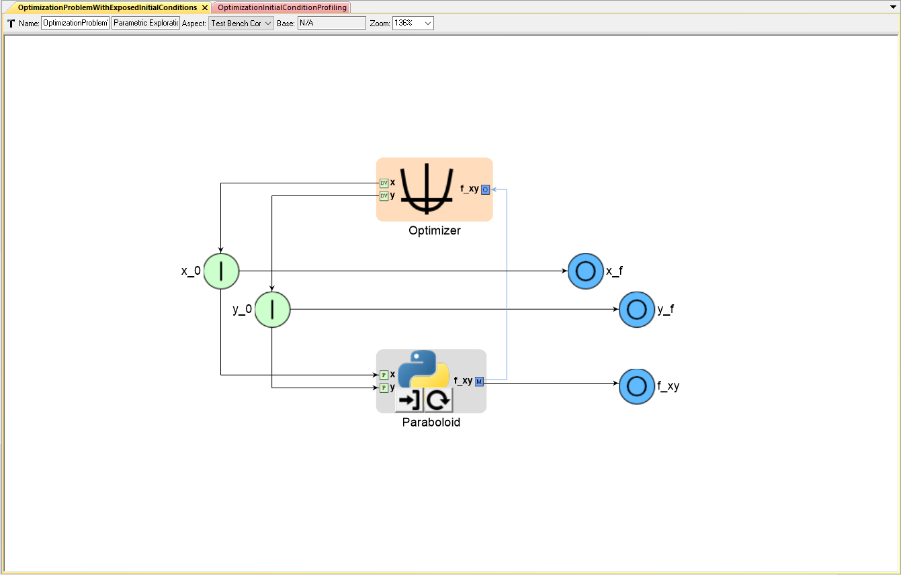
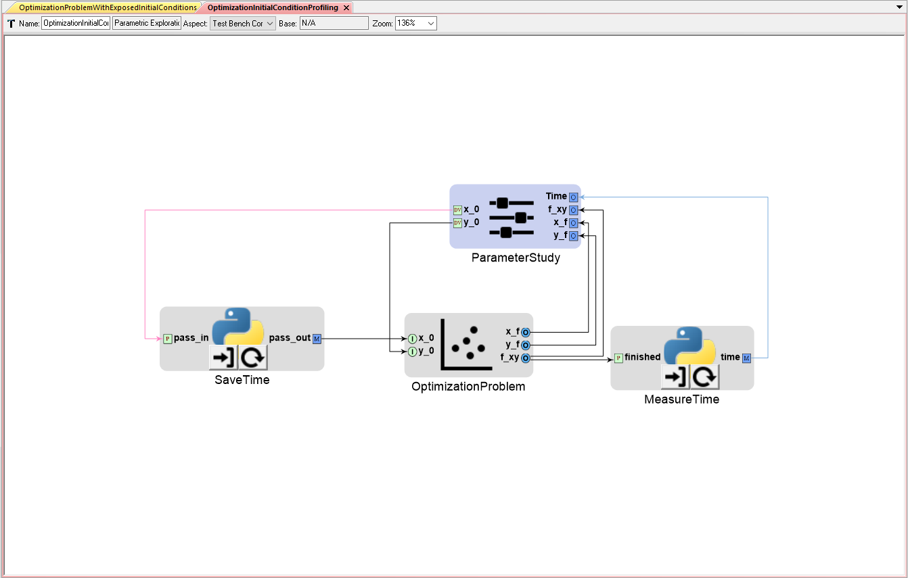
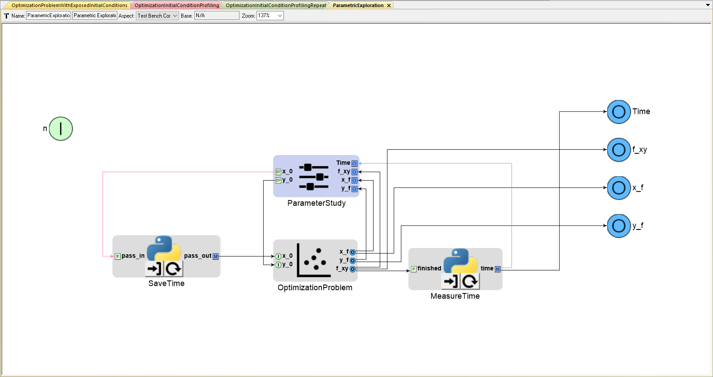
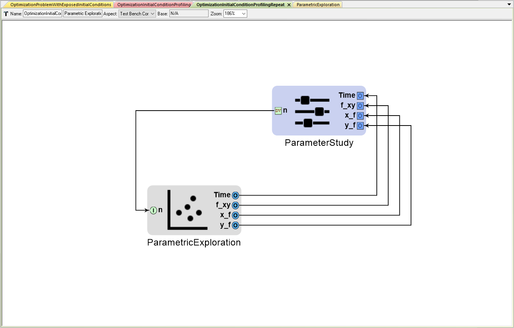

# OptimizationInitialConditionProfiling 

#### Here's an OpenMETA PET 'OptimizationProblem' that contains a single PythonWrapper Component 'Paraboloid' and an Optimizer as well as some Problem Inputs and Problem Outputs


* Two Problem Inputs 'x' and 'y' are connected to Paraboloid's Parameter ports 'x' and 'y' respectively. 
These Problem Inputs each create IndepVarComps `p1` and `p2` and provide a mapping to `p1.x` and `p2.y`.
* The Problem Inputs 'x' and 'y' are also connected to the Problem Outputs 'x_f' and 'y_f'. This allows the final values of the Optimizer's design variables to be
exported to a higher level PET
* Paraboloid's Unknown port 'f_xy' is connected to a Problem Output 'f_xy' and provides a mapping to `Paraboloid.f_xy`


#### Here's an OpenMETA PET 'OptimizationProfiler' that contains 'OptimizationProblem', a Parameter Study, and two PythonWrapper Components 'SaveTime' and 'MeasureTime'


* Notice that ParaboloidProblem's Problem Inputs and Problem Outputs are exposed as ports when it is placed inside another PET


#### Here's an OpenMDAO script that expresses the desired behavior of this OpenMETA model
```python
from __future__ import print_function
from openmdao.api import IndepVarComp, Component, Problem, Group
from openmdao.api import ScipyOptimizer  # Optimizer driver
from openmdao.api import FullFactorialDriver  # FullFactorialDriver driver
from openmdao.api import ExecComp  # 'Quick Component' - useful for creating constraints
from openmdao.api import SubProblem  # Allows for nested drivers - not currently supported in OpenMETA - Introduced in OpenMDAO v.1.7.2.
from openmdao.api import SqliteRecorder  # Recorder
import sqlitedict
import random
import time
from pprint import pprint

# 'Paraboloid' Component
class Paraboloid(Component):
    ''' Evaluates the equation f(x,y) = (x-3)^2 +xy +(y+4)^2 - 3 '''

    def __init__(self):
        super(Paraboloid, self).__init__()
        
        self.add_param('x', val=0.0)
        self.add_param('y', val=0.0)
        
        self.add_output('f_xy', shape=1)
        
    def solve_nonlinear(self, params, unknowns, resids):
        ''' f(x,y) = (x-3)^2 + xy + (y+4)^2 - 3 '''
        
        x = params['x']
        y = params['y']
        
        unknowns['f_xy'] = (x-3.0)**2 + x*y + (y+4.0)**2 - 3.0
        
# 'SaveTime' Component
class SaveTime(Component):
    """ Saves the current time to time.txt """

    def __init__(self):
        super(SaveTime, self).__init__()

        self.add_param('pass_in', val=0.0)
        self.add_output('pass_out', val=0.0)

    def solve_nonlinear(self, params, unknowns, resids):
        
        unknowns['pass_out'] = params['pass_in']
        
        with open('time.txt', 'w') as f_out:
            f_out.write("{:.3f}\n".format(time.time()))        

# 'MeasureTime Component            
class MeasureTime(Component):
    """ Calculates the elapsed time since the time in time.txt. """

    def __init__(self):
        super(MeasureTime, self).__init__()

        self.add_param('finished', val=0.0)
        self.add_output('time', val=0.0)

    def solve_nonlinear(self, params, unknowns, resids):
        
        try:
            with open('time.txt', 'r') as f_in:
                unknowns['time'] = time.time()-float(f_in.readline())
        except IOError:
            unknowns['time'] = -1.0

            
if __name__ == '__main__':

    # Instantiate a sub-level Problem 'OptimizationProblem'.
    # Instantiate a Group and add it to OptimizationProblem.
    optimizationProblem = Problem()
    optimizationProblem.root = Group()
    
    # Add the 'Paraboloid' Component to paraboloidProblem's root Group.
    optimizationProblem.root.add('Paraboloid', Paraboloid())
    
    # Initialize x and y values in seperate IndepVarComps and add them to paraboloidProblem's root group
    # These are added for the two Problem Inputs 'x' and 'y'
    optimizationProblem.root.add('p1', IndepVarComp('x', 0.0))
    optimizationProblem.root.add('p2', IndepVarComp('y', 0.0))
    
    # Connect the IndepVarComps 'p1.x' and 'p2.y' to 'T.Paraboloid.x' and 'T.Paraboloid.y' respectively
    optimizationProblem.root.connect('p1.x', 'Paraboloid.x')
    optimizationProblem.root.connect('p2.y', 'Paraboloid.y')
    
    # We'll need to create ExecComps so that we can pass out the IndepVarComps values as expressed by connecting the Problem Inputs to the Problem Outputs in OpenMETA
    optimizationProblem.root.add('output1', ExecComp('x_f = x'))
    optimizationProblem.root.add('output2', ExecComp('y_f = y'))
    optimizationProblem.root.connect('p1.x', 'output1.x')
    optimizationProblem.root.connect('p2.y', 'output2.y')
    # ^ this is messy but it allows the optimizer design variables' final values to be exported as unknowns (and used in other components).
    # We only have to do this for optimizer design variables that are being provided with an initial value from an outside source
    
    # Add driver
    optimizationProblem.driver = ScipyOptimizer()
    
    # Modify the optimization driver's settings
    optimizationProblem.driver.options['optimizer'] = 'COBYLA'  # Type of Optimizer. 'COBYLA' does not require derivatives
    optimizationProblem.driver.options['tol'] = 1.0e-4  # Tolerance for termination. Not sure exactly what it represents. Default: 1.0e-6
    optimizationProblem.driver.options['maxiter'] = 200  # Maximum iterations. Default: 200
    #optimizationProblem.driver.opt_settings['rhobeg'] = 1.0  # COBYLA-specific setting. Initial step size. Default: 1.0
    #optimizationProblem.driver.opt_settings['catol'] = 0.1  # COBYLA-specific setting. Absolute tolerance for constraint violations. Default: 0.1
    
    # Add design variables, objective, and constraints to the optimization driver
    optimizationProblem.driver.add_desvar('p1.x', lower=-50, upper=50)
    optimizationProblem.driver.add_desvar('p2.y', lower=-50, upper=50)
    optimizationProblem.driver.add_objective('Paraboloid.f_xy')
    
    
    # Instantiate a top-level Problem 'OptimizationProfiler'
    # Instantiate a Group and add it to OptimizationProfiler
    OptimizationProfiler = Problem()
    OptimizationProfiler.root = Group()
    
    # Initialize x and y as IndepVarComps and add them to OptimizationProfiler's root group
    OptimizationProfiler.root.add('p1', IndepVarComp('x_0', 0.0)) 
    OptimizationProfiler.root.add('p2', IndepVarComp('y_0', 0.0)) 
    
    # Add optimizationProblem to OptimizationProfiler as a SubProblem called 'OptimizationProblem' 
    # Include optimizationProblem's Problem Inputs and Problem Outputs in 'params' and 'unknowns' fields SubProblem 
    OptimizationProfiler.root.add('OptimizationProblem', SubProblem(optimizationProblem, params=['p1.x', 'p2.y'],
                                            unknowns=['output1.x_f', 'output2.y_f', 'Paraboloid.f_xy']))  # This is where you designate what to expose to the outside world
    
    # Add the 'SaveTime' and 'MeasureTime' Components to OptimizationProfiler's root Group.
    OptimizationProfiler.root.add('SaveTime', SaveTime())
    OptimizationProfiler.root.add('MeasureTime', MeasureTime())
    
    # Connections
    OptimizationProfiler.root.connect('p1.x_0', 'SaveTime.pass_in')
    OptimizationProfiler.root.connect('p2.y_0', 'OptimizationProblem.p2.y')
    OptimizationProfiler.root.connect('SaveTime.pass_out', 'OptimizationProblem.p1.x')
    OptimizationProfiler.root.connect('OptimizationProblem.Paraboloid.f_xy', 'MeasureTime.finished')
    
    # Add driver
    OptimizationProfiler.driver = FullFactorialDriver(num_levels=11)
    
    # Add design variables and objectives to the parameter study driver
    OptimizationProfiler.driver.add_desvar('p1.x_0', lower=-50, upper=50)
    OptimizationProfiler.driver.add_desvar('p2.y_0', lower=-50, upper=50)
    OptimizationProfiler.driver.add_objective('MeasureTime.time')
    OptimizationProfiler.driver.add_objective('OptimizationProblem.Paraboloid.f_xy')
    OptimizationProfiler.driver.add_objective('OptimizationProblem.output1.x_f')
    OptimizationProfiler.driver.add_objective('OptimizationProblem.output2.y_f')
    
    
    # Data collection
    recorder = SqliteRecorder('record_results')
    recorder.options['record_params'] = True
    recorder.options['record_metadata'] = True
    OptimizationProfiler.driver.add_recorder(recorder)
    
    # Setup
    OptimizationProfiler.setup(check=False)
    
    # Run 
    OptimizationProfiler.run()
    
    # Cleanup
    OptimizationProfiler.cleanup()
    
    # Data retrieval & display
    # Old way - good for debugging IndepVars
    db = sqlitedict.SqliteDict( 'record_results', 'iterations' )
    db_keys = list( db.keys() ) # list() needed for compatibility with Python 3. Not needed for Python 2
    for i in db_keys:
        data = db[i]
        print('\n')
        print(data['Unknowns'])
        print(data['Parameters'])
```
#### Results:  
Run `optimization_initialcondition_profiling_v1.py`


# OptimizationInitialConditionProfilingRepeat

#### Here's an OpenMETA PET 'OptimizationProfiler' that contains 'OptimizationProblem', a Parameter Study, and two PythonWrapper Components 'SaveTime' and 'MeasureTime'


* Notice that a dummy Problem Input 'n' has been added as well as four Problem Outputs 'Time', 'f_xy', 'x_f', and 'y_f'


#### Here's an OpenMETA PET 'OptimizationProfilerRepeat' that contains 'OptimizationProfiler' and a Parameter Study


* The Purpose of OptimizationProfileRepeat is to generate multiple timing profile samples


#### Here's an OpenMDAO script that expresses the desired behavior of this OpenMETA model
```python
'''
# Name: optimization_initialcondition_profiling_v1.py
# Company: MetaMorph, Inc.
# Author(s): Joseph Coombe, Timothy Thomas
# Email: jcoombe@metamorphsoftware.com
# Create Date: 7/12/2017
# Edit Date: 7/12/2017

# Tutorial: Parameter Study problem containing Optimizer problem in order to profile the time it takes Optimizer to converge with different initial condition
#           Adaption of OpenMDAO tutorial: http://openmdao.readthedocs.io/en/1.7.3/usr-guide/tutorials/paraboloid-tutorial.html

# Inputs:

# Outputs:
'''

from __future__ import print_function
from openmdao.api import IndepVarComp, Component, Problem, Group
from openmdao.api import ScipyOptimizer  # Optimizer driver
from openmdao.api import FullFactorialDriver  # FullFactorialDriver driver
from openmdao.api import ExecComp  # 'Quick Component' - useful for creating constraints
from openmdao.api import SubProblem  # Allows for nested drivers - not currently supported in OpenMETA - Introduced in OpenMDAO v.1.7.2.
from openmdao.api import SqliteRecorder  # Recorder
import sqlitedict
import random
import time
from pprint import pprint

# 'Paraboloid' Component
class Paraboloid(Component):
    ''' Evaluates the equation f(x,y) = (x-3)^2 +xy +(y+4)^2 - 3 '''

    def __init__(self):
        super(Paraboloid, self).__init__()
        
        self.add_param('x', val=0.0)
        self.add_param('y', val=0.0)
        
        self.add_output('f_xy', shape=1)
        
    def solve_nonlinear(self, params, unknowns, resids):
        ''' f(x,y) = (x-3)^2 + xy + (y+4)^2 - 3 '''
        
        x = params['x']
        y = params['y']
        
        unknowns['f_xy'] = (x-3.0)**2 + x*y + (y+4.0)**2 - 3.0
        
# 'SaveTime' Component
class SaveTime(Component):
    """ Saves the current time to time.txt """

    def __init__(self):
        super(SaveTime, self).__init__()

        self.add_param('pass_in', val=0.0)
        self.add_output('pass_out', val=0.0)

    def solve_nonlinear(self, params, unknowns, resids):
        
        unknowns['pass_out'] = params['pass_in']
        
        with open('time.txt', 'w') as f_out:
            f_out.write("{:.3f}\n".format(time.time()))        

# 'MeasureTime Component            
class MeasureTime(Component):
    """ Calculates the elapsed time since the time in time.txt. """

    def __init__(self):
        super(MeasureTime, self).__init__()

        self.add_param('finished', val=0.0)
        self.add_output('time', val=0.0)

    def solve_nonlinear(self, params, unknowns, resids):
        
        try:
            with open('time.txt', 'r') as f_in:
                unknowns['time'] = time.time()-float(f_in.readline())
        except IOError:
            unknowns['time'] = -1.0

            
if __name__ == '__main__':

    # Instantiate a sub-level Problem 'OptimizationProblem'.
    # Instantiate a Group and add it to OptimizationProblem.
    optimizationProblem = Problem()
    optimizationProblem.root = Group()
    
    # Add the 'Paraboloid' Component to paraboloidProblem's root Group.
    optimizationProblem.root.add('Paraboloid', Paraboloid())
    
    # Initialize x and y values in seperate IndepVarComps and add them to paraboloidProblem's root group
    # These are added for the two Problem Inputs 'x' and 'y'
    optimizationProblem.root.add('p1', IndepVarComp('x', 0.0))
    optimizationProblem.root.add('p2', IndepVarComp('y', 0.0))
    
    # Connect the IndepVarComps 'p1.x' and 'p2.y' to 'T.Paraboloid.x' and 'T.Paraboloid.y' respectively
    optimizationProblem.root.connect('p1.x', 'Paraboloid.x')
    optimizationProblem.root.connect('p2.y', 'Paraboloid.y')
    
    # We'll need to create ExecComps so that we can pass out the IndepVarComps values as expressed by connecting the Problem Inputs to the Problem Outputs in OpenMETA
    optimizationProblem.root.add('output1', ExecComp('x_f = x'))
    optimizationProblem.root.add('output2', ExecComp('y_f = y'))
    optimizationProblem.root.connect('p1.x', 'output1.x')
    optimizationProblem.root.connect('p2.y', 'output2.y')
    # ^ this is messy but it allows the optimizer design variables' final values to be exported as unknowns (and used in other components).
    # We only have to do this for optimizer design variables that are being provided with an initial value from an outside source
    
    # Add driver
    optimizationProblem.driver = ScipyOptimizer()
    
    # Modify the optimization driver's settings
    optimizationProblem.driver.options['optimizer'] = 'COBYLA'  # Type of Optimizer. 'COBYLA' does not require derivatives
    optimizationProblem.driver.options['tol'] = 1.0e-4  # Tolerance for termination. Not sure exactly what it represents. Default: 1.0e-6
    optimizationProblem.driver.options['maxiter'] = 200  # Maximum iterations. Default: 200
    #optimizationProblem.driver.opt_settings['rhobeg'] = 1.0  # COBYLA-specific setting. Initial step size. Default: 1.0
    #optimizationProblem.driver.opt_settings['catol'] = 0.1  # COBYLA-specific setting. Absolute tolerance for constraint violations. Default: 0.1
    
    # Add design variables, objective, and constraints to the optimization driver
    optimizationProblem.driver.add_desvar('p1.x', lower=-50, upper=50)
    optimizationProblem.driver.add_desvar('p2.y', lower=-50, upper=50)
    optimizationProblem.driver.add_objective('Paraboloid.f_xy')
    
    
    # Instantiate a mid-level Problem 'OptimizationProfiler'
    # Instantiate a Group and add it to OptimizationProfiler
    OptimizationProfiler = Problem()
    OptimizationProfiler.root = Group()
    
    # Initialize x and y as IndepVarComps and add them to OptimizationProfiler's root group
    OptimizationProfiler.root.add('p1', IndepVarComp('x_0', 0.0)) 
    OptimizationProfiler.root.add('p2', IndepVarComp('y_0', 0.0)) 
    OptimizationProfiler.root.add('p3', IndepVarComp('n', 0.0)) 
    
    # Add optimizationProblem to OptimizationProfiler as a SubProblem called 'OptimizationProblem' 
    # Include optimizationProblem's Problem Inputs and Problem Outputs in 'params' and 'unknowns' fields of SubProblem 
    OptimizationProfiler.root.add('OptimizationProblem', SubProblem(optimizationProblem, params=['p1.x', 'p2.y'],
                                            unknowns=['output1.x_f', 'output2.y_f', 'Paraboloid.f_xy']))  # This is where you designate what to expose to the outside world
    
    # Add the 'SaveTime' and 'MeasureTime' Components to OptimizationProfiler's root Group.
    OptimizationProfiler.root.add('SaveTime', SaveTime())
    OptimizationProfiler.root.add('MeasureTime', MeasureTime())
    
    # Connections
    OptimizationProfiler.root.connect('p1.x_0', 'SaveTime.pass_in')
    OptimizationProfiler.root.connect('p2.y_0', 'OptimizationProblem.p2.y')
    OptimizationProfiler.root.connect('SaveTime.pass_out', 'OptimizationProblem.p1.x')
    OptimizationProfiler.root.connect('OptimizationProblem.Paraboloid.f_xy', 'MeasureTime.finished')
    
    # Add driver
    OptimizationProfiler.driver = FullFactorialDriver(num_levels=11)
    
    # Add design variables and objectives to the parameter study driver
    OptimizationProfiler.driver.add_desvar('p1.x_0', lower=-50, upper=50)
    OptimizationProfiler.driver.add_desvar('p2.y_0', lower=-50, upper=50)
    OptimizationProfiler.driver.add_objective('MeasureTime.time')
    OptimizationProfiler.driver.add_objective('OptimizationProblem.Paraboloid.f_xy')
    OptimizationProfiler.driver.add_objective('OptimizationProblem.output1.x_f')
    OptimizationProfiler.driver.add_objective('OptimizationProblem.output2.y_f')
    
    
    # Instantiate a top-level Problem 'OptimizationProfilerRepeat'
    # Instantiate a Group and add it to OptimizationProfilerRepeat
    OptimizationProfilerRepeat = Problem()
    OptimizationProfilerRepeat.root = Group()
    
    # Initialize n as a IndepVarComp and add it to OptimizationProfilerRepeat's root group
    OptimizationProfilerRepeat.root.add('p1', IndepVarComp('n', 0.0)) 
    
    # Add OptimizationProfiler to OptimizationProfilerRepeat as a SubProblem called 'OptimizationProfiler' 
    # Include OptimizationProfiler's Problem Inputs and Problem Outputs in 'params' and 'unknowns' fields of SubProblem 
    OptimizationProfilerRepeat.root.add('OptimizationProfiler', SubProblem(OptimizationProfiler, params=['p3.n'],
                                            unknowns=['OptimizationProblem.output1.x_f', 'OptimizationProblem.output2.y_f', \
                                                'OptimizationProblem.Paraboloid.f_xy', 'MeasureTime.time']))  # This is where you designate what to expose to the outside world
   
    # Connections
    OptimizationProfilerRepeat.root.connect('p1.n', 'OptimizationProfiler.p3.n')  # note that OptimizationProfiler.p3.n isn't connected to anything inside OptimizationProfiler
        
    # Add driver
    OptimizationProfilerRepeat.driver = FullFactorialDriver(num_levels=10)  # generate 10 profiler samples
    OptimizationProfilerRepeat.driver.add_desvar('p1.n', lower=0.0, upper=10.0)
    OptimizationProfilerRepeat.driver.add_objective('OptimizationProfiler.MeasureTime.time')
    OptimizationProfilerRepeat.driver.add_objective('OptimizationProfiler.OptimizationProblem.Paraboloid.f_xy')
    OptimizationProfilerRepeat.driver.add_objective('OptimizationProfiler.OptimizationProblem.output1.x_f')
    OptimizationProfilerRepeat.driver.add_objective('OptimizationProfiler.OptimizationProblem.output2.y_f')
    
    # Data collection
    recorder = SqliteRecorder('record_results')
    recorder.options['record_params'] = True
    recorder.options['record_metadata'] = True
    OptimizationProfilerRepeat.driver.add_recorder(recorder)
    
    # Setup
    OptimizationProfilerRepeat.setup(check=False)
    
    # Run 
    OptimizationProfilerRepeat.run()
    
    # Cleanup
    OptimizationProfilerRepeat.cleanup()
    
    # Data retrieval & display
    # Old way - good for debugging IndepVars
    db = sqlitedict.SqliteDict( 'record_results', 'iterations' )
    db_keys = list( db.keys() ) # list() needed for compatibility with Python 3. Not needed for Python 2
    for i in db_keys:
        data = db[i]
        print('\n')
        print(data['Unknowns'])
        print(data['Parameters'])
```
#### Results:  
Run `optimization_initialcondition_profiling__repeat_v1.py`
