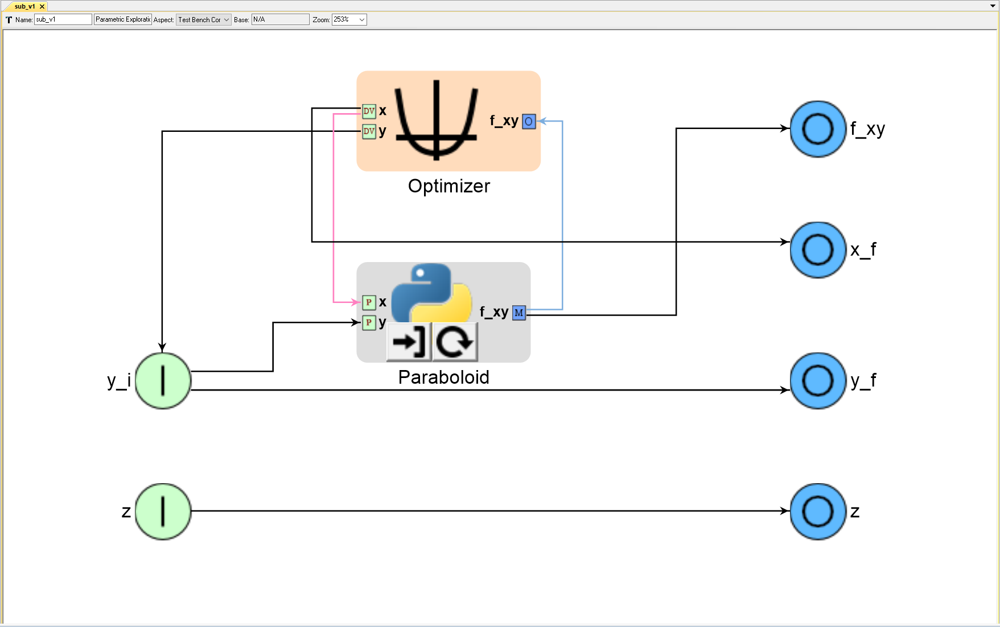
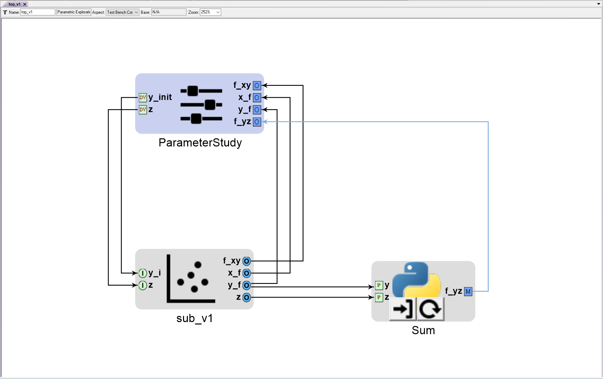

# PET Buildup - Connecting Problem Inputs/Design Variables to Problem Outputs
Incremental buildup of a PET in OpenMETA along with its intended OpenMDAO behavior.

This example focuses on our proposed solution to a specific problem that we encountered in OpenMDAO when trying to connect Problem Inputs to Problem Outputs.

Suppose, inside your 'Vahana' PET, you have a sub-PET 'Optimize' that minimizes total energy use 'E' by optimizing the propeller radius 'rProp'. The 'Vahana' 
PET also has a Component 'CalculateCost' that takes in two Parameters 'E' and 'rProp' in order to calculate the estimated trip cost 'C'.

Now, there is no problem if inside 'Optimize' the Design Variable 'rProp' is not connected to a Problem Input. You can simply connect
the Optimizer's Design Variable 'rProp' to a Problem Output within 'Optimize' and `run_mdao` will add the IndepVarComp associated with 'rProp'
to the SubProblem constructor's list of unknowns (`Vahana.root.add('Optimize', SubProblem('Optimize', params=[], unknowns=['p1.rProp' , '... .E'])))`.

However, there is a problem if the Design Variable 'rProp' is connected to a 'Problem Input' inside 'Optimize' since Problem Inputs
are also exposed in the SubProblem constructor. If you connect the Problem Input 'rProp' to a Problem Output, `run_mdao` will add the IndepVarComp
associated with 'rProp' to both the SubProblem constructor's list of unknowns and params (`Vahana.root.add('Optimize', SubProblem('Optimize', 
params=['p1.rProp'], unknowns=['p1.rProp' , '... .E']))). Then `open_mdao` will give you an error when it tries to connect `Optimize.p1.rProp` to 
`CalculateCost.rProp` - `Target 'CalculateCost.rProp' is connected to multiple unknowns: ['Optimize.p1.rProp', 'p1.rProp']`

In OpenMDAO, if you have three Components `foo`, `bar`, and `baz` - each with an input `x` and an output `z` - and you make the following connect statements:
`prob.root.connect('foo.z', 'bar.x')`
`prob.root.connect('bar.x', 'baz.x')`
OpenMDAO will effectively make the following connections:
`prob.root.connect('foo.z', 'bar.x')`
`prob.root.connect('foo.z', 'baz.x')`

Our workaround is to have `run_mdao` create a ExecComp (`Optimize.add('output', ExecComp('rProp = input'))`) for every Problem Input connected to a Problem 
Output within a PET, connect the Problem Input's associated IndepVarComp to the ExecComp (`Optimize.connect('Optimize.p1.rProp', 'output.input')`), and
and add that ExecComp's output to the SubProblem constructor's list of unknowns (`Vahana.root.add('Optimize', SubProblem('Optimize', params=['p1.rProp'], 
unknowns=['output.rProp' , '... .E']))`). This is pretty hacky so if anyone has a better idea, I'm all ears.

---
### OpenMETA PET with Optimizer, PythonWrapper Component, and multiple Problem Inputs/Outputs


### OpenMDAO interpretation
```python
from __future__ import print_function
from openmdao.api import IndepVarComp, Component, Problem, Group
from openmdao.api import ScipyOptimizer  # Optimizer driver
from openmdao.api import SqliteRecorder  # Recorder
import sqlitedict
from pprint import pprint

# PythonWrapper Components
class Paraboloid(Component):
    ''' Evaluates the equation f(x,y) = (x-3)^2 +xy +(y+4)^2 - 3 '''

    def __init__(self):
        super(Paraboloid, self).__init__()
        
        self.add_param('x', val=0.0)
        self.add_param('y', val=0.0)
        
        self.add_output('f_xy', shape=1)
        
    def solve_nonlinear(self, params, unknowns, resids):
        ''' f(x,y) = (x-3)^2 + xy + (y+4)^2 - 3 '''
        
        x = params['x']
        y = params['y']
        
        unknowns['f_xy'] = (x-3.0)**2 + x*y + (y+4.0)**2 - 3.0

        
if __name__ == '__main__':

    # Instantiate a Problem 'sub'
    # Instantiate a Group and add it to sub
    sub = Problem()
    sub.root = Group()
    
    # Add the 'Paraboloid' Component to sub's root Group.
    sub.root.add('Paraboloid', Paraboloid())
    
    # Initialize x as a IndepVarComp and add it to sub's root group as 'p1.x'
    # p1.x and p2.y_i are initialized to 0.0 since neither was explicity initialized
    # and they both have ranges of -50 to +50. Default initialization: (+50 - (-50)) / 2.0 = 0
    sub.root.add('p1', IndepVarComp('x', 0.0))  
    sub.root.add('p2', IndepVarComp('y_i', 0.0))
    
    # Connect components
    sub.root.connect('p1.x', 'Paraboloid.x')
    sub.root.connect('p2.y_i', 'Paraboloid.y')
    
    # Add driver
    sub.driver = ScipyOptimizer()
    
    # Modify the optimization driver's settings
    sub.driver.options['optimizer'] = 'COBYLA'      # Type of Optimizer. 'COBYLA' does not require derivatives
    sub.driver.options['tol'] = 1.0e-4              # Tolerance for termination. Not sure exactly what it represents. Default: 1.0e-6
    sub.driver.options['maxiter'] = 200             # Maximum iterations. Default: 200
    #sub.driver.opt_settings['rhobeg'] = 1.0        # COBYLA-specific setting. Initial step size. Default: 1.0
    #sub.driver.opt_settings['catol'] = 0.1         # COBYLA-specific setting. Absolute tolerance for constraint violations. Default: 0.1
    
    # Add design variables, objective, and constraints to the optimization driver
    sub.driver.add_desvar('p1.x', lower=-50, upper=50)
    sub.driver.add_desvar('p2.y_i', lower=-50, upper=50)
    sub.driver.add_objective('Paraboloid.f_xy')
    
    # Setup, run, & cleanup
    sub.setup(check=False)
    sub.run()
    sub.cleanup()

```
#### Results:  
Run `sub_v1.py`

---
### OpenMETA PET with Parameter Study, 'sub_v1' PET, and PythonWrapper Component


### OpenMDAO interpretation
```python
from __future__ import print_function
from openmdao.api import IndepVarComp, Component, Problem, Group
from openmdao.api import ScipyOptimizer  # Optimizer driver
from openmdao.api import SubProblem  # Allows for nested drivers - not currently supported in OpenMETA - Introduced in OpenMDAO v.1.7.2.
from openmdao.api import FullFactorialDriver  # FullFactorialDriver driver
from openmdao.api import ExecComp
from openmdao.api import SqliteRecorder  # Recorder
import sqlitedict
from pprint import pprint

# PythonWrapper Components
class Paraboloid(Component):
    ''' Evaluates the equation f(x,y) = (x-3)^2 +xy +(y+4)^2 - 3 '''

    def __init__(self):
        super(Paraboloid, self).__init__()
        
        self.add_param('x', val=0.0)
        self.add_param('y', val=0.0)
        
        self.add_output('f_xy', shape=1)
        
    def solve_nonlinear(self, params, unknowns, resids):
        ''' f(x,y) = (x-3)^2 + xy + (y+4)^2 - 3 '''
        
        x = params['x']
        y = params['y']
        
        unknowns['f_xy'] = (x-3.0)**2 + x*y + (y+4.0)**2 - 3.0
        
class Sum(Component):
    ''' Evaluates the equation f(y,z) = y + z '''

    def __init__(self):
        super(Sum, self).__init__()
        
        self.add_param('y', val=0.0)
        self.add_param('z', val=0.0)
        
        self.add_output('f_yz', shape=1)
        
    def solve_nonlinear(self, params, unknowns, resids):
        ''' f(y,z) = y + z '''
        
        y = params['y']
        z = params['z']
        
        unknowns['f_yz'] = y + z
        

if __name__ == '__main__':

    # Instantiate a Problem 'sub'
    # Instantiate a Group and add it to sub
    sub = Problem()
    sub.root = Group()
    
    # Add the 'Paraboloid' Component to sub's root Group.
    sub.root.add('Paraboloid', Paraboloid())
    
    # Initialize x as a IndepVarComp and add it to sub's root group as 'p1.x'
    # p1.x and p2.y_i are initialized to 0.0 since neither was explicity initialized
    # and they both have ranges of -50 to +50. Default initialization: (+50 - (-50)) / 2.0 = 0
    sub.root.add('p1', IndepVarComp('x', 0.0))  
    sub.root.add('p2', IndepVarComp('y_i', 0.0))
    
    # Initialize z as a IndepVarComp and add it to sub's root group as 'p3.z'
    # Not sure if we will support running PETs with un-driven Problem Inputs but let's initialize it to 0.0
    sub.root.add('p3', IndepVarComp('z', 0.0))
    
    # Connect components
    sub.root.connect('p1.x', 'Paraboloid.x')
    sub.root.connect('p2.y_i', 'Paraboloid.y')
    
    # Add ExecComps for all the Problem Inputs connected directly to Problem Outputs
    # It seems reasonable to use the OpenMETA Problem Output's name as the output
    sub.root.add('output1', ExecComp('y_f = input'))
    sub.root.add('output2', ExecComp('z = input'))
    
    # Connect each IndepVarComp associated with Problem Inputs to its respective Problem Outputs
    sub.root.connect('p2.y_i','output1.input')
    sub.root.connect('p3.z','output2.input')
    
    # Add driver
    sub.driver = ScipyOptimizer()
    
    # Modify the optimization driver's settings
    sub.driver.options['optimizer'] = 'COBYLA'      # Type of Optimizer. 'COBYLA' does not require derivatives
    sub.driver.options['tol'] = 1.0e-4              # Tolerance for termination. Not sure exactly what it represents. Default: 1.0e-6
    sub.driver.options['maxiter'] = 200             # Maximum iterations. Default: 200
    #sub.driver.opt_settings['rhobeg'] = 1.0        # COBYLA-specific setting. Initial step size. Default: 1.0
    #sub.driver.opt_settings['catol'] = 0.1         # COBYLA-specific setting. Absolute tolerance for constraint violations. Default: 0.1
    
    # Add design variables, objective, and constraints to the optimization driver
    sub.driver.add_desvar('p1.x', lower=-50, upper=50)
    sub.driver.add_desvar('p2.y_i', lower=-50, upper=50)
    sub.driver.add_objective('Paraboloid.f_xy')
    
    
    # Instantiate a Problem 'top'
    # Instantiate a Group and add it to top
    top = Problem()
    top.root = Group()
    
    # Add sub to top as a SubProblem called 'Sub' 
    # Include sub's Problem Inputs and Problem Outputs in 'params' and 'unknowns' fields of SubProblem 
    top.root.add('Sub', SubProblem(sub, params=['p2.y_i', 'p3.z'],
                                        unknowns=['Paraboloid.f_xy', 'p1.x', 'output1.y_f', 'output2.z']))  # This is where you designate what to expose to the outside world)

    # Add PythonWrapper Component 'Sum'
    top.root.add('Sum', Sum())

    # Initialize x and z as IndepVarComps and add them to top's root group
    top.root.add('p1', IndepVarComp('y_init', 0.0))
    top.root.add('p2', IndepVarComp('z', 0.0))
    
    # Connections
    top.root.connect('p1.y_init', 'Sub.p2.y_i')
    top.root.connect('p2.z', 'Sub.p3.z')
    top.root.connect('Sub.output1.y_f', 'Sum.y')
    top.root.connect('Sub.output2.z', 'Sum.z')
    
    # Add driver
    top.driver = FullFactorialDriver(num_levels=11)
        
    # Add design variables and objectives to the parameter study driver
    top.driver.add_desvar('p1.y_init', lower=-50, upper=50)
    top.driver.add_objective('Sub.Paraboloid.f_xy')
    top.driver.add_objective('Sub.p1.x')
    top.driver.add_objective('Sub.output1.y_f')
    top.driver.add_objective('Sum.f_yz')
    
    # Setup, run, & cleanup
    top.setup(check=False)
    top.run()
    top.cleanup()
```
#### Results:  
Run `top_v1.py`

---
