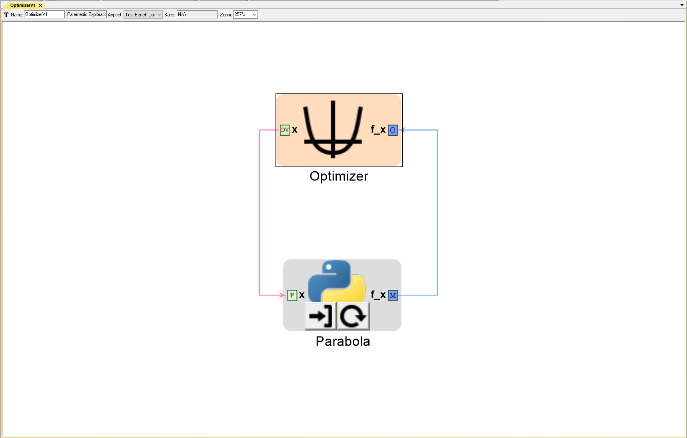

# PETBuildupConstants
Incremental buildup of a PET in OpenMETA along with its intended OpenMDAO behavior.

This example focuses on our proposal to add new conditional behavior to the Constants block in OpenMETA, so that connecting a Constants 
block to a Problem Input within the same PET will set the initialization value for the IndepVarComp associated with that Problem Input.

psuedo code:
```python
if Constants 'c' is connected to Problem Input 'x' in OpenMETA:
  prob.root.add('ProblemInput', IndepVarComp('x', c.getValue()))  # in OpenMDAO
else:  # if Constants 'c' is connected to some other port 'system.x' in OpenMETA:
  prob.root.add('Constants', IndepVarComp('c', c.getValue())))  # in OpenMDAO
  prob.root.add('system', System())  # in OpenMDAO
  prob.root.connect('Constants.c', 'system.x')  # in OpenMDAO
  
```
---
### OpenMETA PET 'OptimizerV1' containing an Optimizer and a PythonWrapper Component


### OpenMDAO interpretation of PET
```python
# PythonWrapper Components
class Parabola(Component):
    ''' Evaluates the equation f(x) = (x-3)^2 - 3 '''

    def __init__(self):
        super(Parabola, self).__init__()
        
        self.add_param('x', val=0.0)
        
        self.add_output('f_x', shape=1)
        
    def solve_nonlinear(self, params, unknowns, resids):
        ''' f(x) = (x-3)^2 - 3 '''
        
        x = params['x']
        
        unknowns['f_x'] = (x-3.0)**2 - 3.0

        
if __name__ == '__main__':

    # Instantiate a Problem 'sub'
    # Instantiate a Group and add it to sub
    sub = Problem()
    sub.root = Group()
    
    # Add the 'Parabola' Component to sub's root Group.
    sub.root.add('Parabola', Parabola())
    
    # Initialize x as a IndepVarComp and add it to sub's root group as 'p1.x'
    # run_mdao already does something like this for all driver design variables
    # p1.x is initialized to 0.0 because the OpenMETA Design Variable 'x' has a range of -50 to +50
    sub.root.add('p1', IndepVarComp('x', 0.0))  
    
    # Connect the IndepVarComp p1.x to Parabola.x
    sub.root.connect('p1.x', 'Parabola.x')
    
    # Add driver
    sub.driver = ScipyOptimizer()
    
    # Modify the optimization driver's settings
    sub.driver.options['optimizer'] = 'COBYLA'      # Type of Optimizer. 'COBYLA' does not require derivatives
    sub.driver.options['tol'] = 1.0e-4              # Tolerance for termination. Not sure exactly what it represents. Default: 1.0e-6
    sub.driver.options['maxiter'] = 200             # Maximum iterations. Default: 200
    
    # Add design variables, objective, and constraints to the optimization driver
    sub.driver.add_desvar('p1.x', lower=-50, upper=50)
    sub.driver.add_objective('Parabola.f_x')
    
    
    # Data collection
    recorder = SqliteRecorder('record_results')
    recorder.options['record_params'] = True
    recorder.options['record_metadata'] = True
    sub.driver.add_recorder(recorder)
    
    # Setup, run, & cleanupt
    sub.setup(check=False)
    sub.run()
    sub.cleanup()
    
    # Data retrieval & display
    # Old way - good for debugging IndepVars
    db = sqlitedict.SqliteDict( 'record_results', 'iterations' )
    db_keys = list( db.keys() ) # list() needed for compatibility with Python 3. Not needed for Python 2
    for i in db_keys:
        data = db[i]
        print('\n')
        print(data['Unknowns'])
        print(data['Parameters'])
```

---
