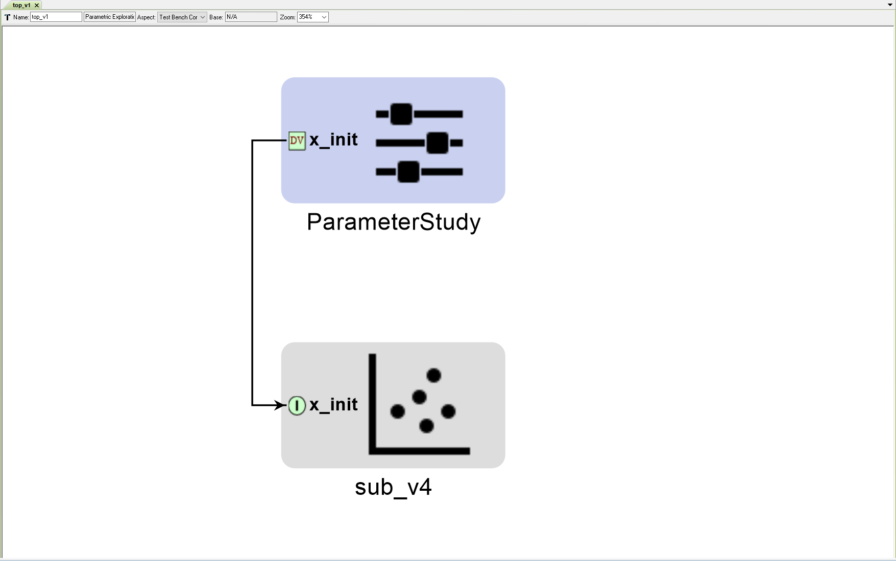
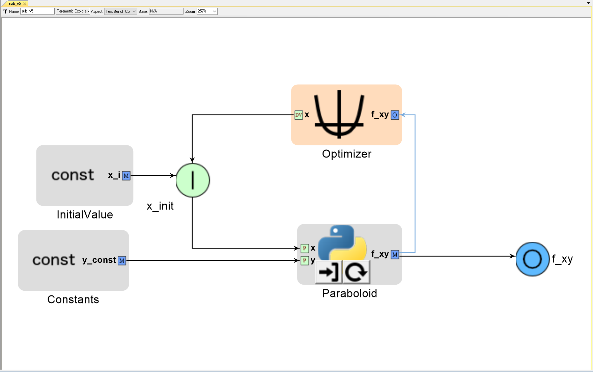

# PETBuildupConstants
Incremental buildup of a PET in OpenMETA along with its intended OpenMDAO behavior.

This example focuses on our proposal to add new conditional behavior to the Constants block in OpenMETA, so that connecting a Constants 
block to a Problem Input within the same PET will set the initialization value for the IndepVarComp associated with that Problem Input.

psuedo code:
```python
if Constants 'c' is connected to Problem Input 'x' in OpenMETA:
  prob.root.add('ProblemInput', IndepVarComp('x', c.getValue()))  # in OpenMDAO
else:  # if Constants 'c' is connected to some other port 'system.x' in OpenMETA:
  prob.root.add('Constants', IndepVarComp('c', c.getValue())))  # in OpenMDAO
  prob.root.add('system', System())  # in OpenMDAO
  prob.root.connect('Constants.c', 'system.x')  # in OpenMDAO
  
```
---
### OpenMETA PET 'sub_v1' containing an Optimizer and a PythonWrapper Component


### OpenMDAO interpretation
```python
# PythonWrapper Components
class Parabola(Component):
    ''' Evaluates the equation f(x) = (x-3)^2 - 3 '''

    def __init__(self):
        super(Parabola, self).__init__()
        
        self.add_param('x', val=0.0)
        
        self.add_output('f_x', shape=1)
        
    def solve_nonlinear(self, params, unknowns, resids):
        ''' f(x) = (x-3)^2 - 3 '''
        
        x = params['x']
        
        unknowns['f_x'] = (x-3.0)**2 - 3.0

        
if __name__ == '__main__':

    # Instantiate a Problem 'sub'
    # Instantiate a Group and add it to sub
    sub = Problem()
    sub.root = Group()
    
    # Add the 'Parabola' Component to sub's root Group.
    sub.root.add('Parabola', Parabola())
    
    # Initialize x as a IndepVarComp and add it to sub's root group as 'p1.x'
    # run_mdao already does something like this for all driver design variables
    # p1.x is initialized to 0.0 because the OpenMETA Design Variable 'x' has a range of -50 to +50
    sub.root.add('p1', IndepVarComp('x', 0.0))  
    
    # Connect the IndepVarComp p1.x to Parabola.x
    sub.root.connect('p1.x', 'Parabola.x')
    
    # Add driver
    sub.driver = ScipyOptimizer()
    
    # Modify the optimization driver's settings
    sub.driver.options['optimizer'] = 'COBYLA'      # Type of Optimizer. 'COBYLA' does not require derivatives
    sub.driver.options['tol'] = 1.0e-4              # Tolerance for termination. Not sure exactly what it represents. Default: 1.0e-6
    sub.driver.options['maxiter'] = 200             # Maximum iterations. Default: 200
    
    # Add design variables, objective, and constraints to the optimization driver
    sub.driver.add_desvar('p1.x', lower=-50, upper=50)
    sub.driver.add_objective('Parabola.f_x')
    
    # Setup, run, & cleanupt
    sub.setup(check=False)
    sub.run()
    sub.cleanup()
```
#### Results:  
Run `sub_v1.py`

---
### OpenMETA PET 'sub_v2' - a Problem Input 'x_init' has been added

* Adding a Problem Input in OpenMETA explicitly creates an IndepVarComp 'p1.x_init' in OpenMDAO.
* Since the Problem Input is not explicitly initialized in OpenMETA, run_mdao gives it the default initial value of (min+max)/2.0

### OpenMDAO interpretation
```python
from __future__ import print_function
from openmdao.api import IndepVarComp, Component, Problem, Group
from openmdao.api import ScipyOptimizer  # Optimizer driver
from openmdao.api import SqliteRecorder  # Recorder
import sqlitedict
from pprint import pprint

# PythonWrapper Components
class Parabola(Component):
    ''' Evaluates the equation f(x) = (x-3)^2 - 3 '''

    def __init__(self):
        super(Parabola, self).__init__()
        
        self.add_param('x', val=0.0)
        
        self.add_output('f_x', shape=1)
        
    def solve_nonlinear(self, params, unknowns, resids):
        ''' f(x) = (x-3)^2 - 3 '''
        
        x = params['x']
        
        unknowns['f_x'] = (x-3.0)**2 - 3.0

        
if __name__ == '__main__':

    # Instantiate a Problem 'sub'
    # Instantiate a Group and add it to sub
    sub = Problem()
    sub.root = Group()
    
    # Add the 'Parabola' Component to sub's root Group.
    sub.root.add('Parabola', Parabola())
    
    # Initialize x_init as a IndepVarComp and add it to sub's root group as 'p1.x_init'
    # p1.x_init is initialized to 0.0 because the OpenMETA Design Variable 'x' has a range of -50 to +50
    sub.root.add('p1', IndepVarComp('x_init', 0.0))
    
    # Connect the IndepVarComp p1.x to Parabola.x
    sub.root.connect('p1.x_init', 'Parabola.x')
    
    # Add driver
    sub.driver = ScipyOptimizer()
    
    # Modify the optimization driver's settings
    sub.driver.options['optimizer'] = 'COBYLA'      # Type of Optimizer. 'COBYLA' does not require derivatives
    sub.driver.options['tol'] = 1.0e-4              # Tolerance for termination. Not sure exactly what it represents. Default: 1.0e-6
    sub.driver.options['maxiter'] = 200             # Maximum iterations. Default: 200
    #sub.driver.opt_settings['rhobeg'] = 1.0        # COBYLA-specific setting. Initial step size. Default: 1.0
    #sub.driver.opt_settings['catol'] = 0.1         # COBYLA-specific setting. Absolute tolerance for constraint violations. Default: 0.1
    
    # Add design variables, objective, and constraints to the optimization driver
    sub.driver.add_desvar('p1.x_init', lower=-50, upper=50)
    sub.driver.add_objective('Parabola.f_x')
    
    # Setup, run, & cleanupt
    sub.setup(check=False)
    sub.run()
    sub.cleanup()
```
#### Results:  
Run `sub_v2.py`
* `sub_v2.py` produces the same result as `sub_v1.py` since only name-changes were made

---
### OpenMETA PET 'sub_v3' - now a Constants block 'InitialValue' with a single metric 'x_i' has been connected to Problem Input 'x_init'

* Since the Constants block is connected to a Problem Input 'x_init' in OpenMETA, the IndepVarComp `p1.x_init` should be initialized with the value of 'InitialValue'->'x_i' in OpenMDAO. There is no need for run_mdao to create a IndepVarComp for 'InitialValue'->'x_i' since it should not be driving `p1.x_init` during run().

### OpenMDAO interpretation
#### The only change to the OpenMDAO interpretation is that 'p1.x_init' is now initialized with a value of 2.0
```python
    # Initialize x_init as a IndepVarComp and add it to sub's root group as 'p1.x_init'
    # p1.x_init is initialized to 2.0 because in OpenMETA, the metric 'x_i' (inside the Constants 'InitialValue') was connected to 'x_init'
    sub.root.add('p1', IndepVarComp('x_init', 2.0))  
```
#### Results:  
Run `sub_v3.py`
* `sub_v3.py` produces the same final result as `sub_v2.py` (min. of `Parabola.f_x` = -3.0 when `Parabola.x` = 3.0); however, `sub_v3.py` takes 2 fewer iterations to converge compared to `sub_v2.py`. This is because the initial value of 2.0 for `p1.x_init` in `sub_v3.py` is closer to the final optimization result than the initial value of 0.0 for `p1.x_init` in `sub_v2.py`.

---
### OpenMETA PET 'sub_v4' - the PythonWrapper Component now has a new input that is driver by a second Constants block 'Constants'

* In order to emphasize that `run_mdao` should now treat OpenMETA Constants differently depending on whether or not they are connected to a Problem Input, we've added another input 'x' to our PythonWrapper Component. Now `run_mdao` will interpret 'InitialValue'->'x_i' as 
providing the initial value for `p1.x_init` and interpret 'Constants'->'y_const' as an IndepVarComp `c1.y_const` that is connected to `Paraboloid.y`.

### OpenMDAO interpretation
```python
from __future__ import print_function
from openmdao.api import IndepVarComp, Component, Problem, Group
from openmdao.api import ScipyOptimizer  # Optimizer driver
from openmdao.api import SqliteRecorder  # Recorder
import sqlitedict
from pprint import pprint

# PythonWrapper Components
class Paraboloid(Component):
    ''' Evaluates the equation f(x,y) = (x-3)^2 +xy +(y+4)^2 - 3 '''

    def __init__(self):
        super(Paraboloid, self).__init__()
        
        self.add_param('x', val=0.0)
        self.add_param('y', val=0.0)
        
        self.add_output('f_xy', shape=1)
        
    def solve_nonlinear(self, params, unknowns, resids):
        ''' f(x,y) = (x-3)^2 + xy + (y+4)^2 - 3 '''
        
        x = params['x']
        y = params['y']
        
        unknowns['f_xy'] = (x-3.0)**2 + x*y + (y+4.0)**2 - 3.0

        
if __name__ == '__main__':

    # Instantiate a Problem 'sub'
    # Instantiate a Group and add it to sub
    sub = Problem()
    sub.root = Group()
    
    # Add the 'Paraboloid' Component to sub's root Group.
    sub.root.add('Paraboloid', Paraboloid())
    
    # Add an IndepVarComp c1.y_const for 'Constants->y_const' to sub's root Group.
    sub.root.add('c1', IndepVarComp('y_const', 10.0))  # normal Constants behavior
    
    # Initialize x_init as a IndepVarComp and add it to sub's root group as 'p1.x_init'
    # p1.x_init is initialized to 2.0 because in OpenMETA, the metric 'x_i' (inside the Constants 'InitialValue') was connected to 'x_init'
    sub.root.add('p1', IndepVarComp('x_init', 2.0))  
    
    # Connect components
    sub.root.connect('p1.x_init', 'Paraboloid.x')
    sub.root.connect('c1.y_const', 'Paraboloid.y')
    
    # Add driver
    sub.driver = ScipyOptimizer()
    
    # Modify the optimization driver's settings
    sub.driver.options['optimizer'] = 'COBYLA'      # Type of Optimizer. 'COBYLA' does not require derivatives
    sub.driver.options['tol'] = 1.0e-4              # Tolerance for termination. Not sure exactly what it represents. Default: 1.0e-6
    sub.driver.options['maxiter'] = 200             # Maximum iterations. Default: 200
    #sub.driver.opt_settings['rhobeg'] = 1.0        # COBYLA-specific setting. Initial step size. Default: 1.0
    #sub.driver.opt_settings['catol'] = 0.1         # COBYLA-specific setting. Absolute tolerance for constraint violations. Default: 0.1
    
    # Add design variables, objective, and constraints to the optimization driver
    sub.driver.add_desvar('p1.x_init', lower=-50, upper=50)
    sub.driver.add_objective('Paraboloid.f_xy')
    
    # Setup, run, & cleanup
    sub.setup(check=False)
    sub.run()
    sub.cleanup()
```
#### Results:  
Run `sub_v4.py`

---
### OpenMETA PET 'top_v1' containing 'sub_v4' and a Parameter Study
* We've no placed 'sub_v4' inside another PET 'top_v1'. 'top_v1' will vary the initial value of the sup-PET's optimizer design variable 'x_init'.




### OpenMDAO interpretation
```python
from __future__ import print_function
from openmdao.api import IndepVarComp, Component, Problem, Group
from openmdao.api import ScipyOptimizer  # Optimizer driver
from openmdao.api import SqliteRecorder  # Recorder
from openmdao.api import SubProblem  # Allows for nested drivers - not currently supported in OpenMETA - Introduced in OpenMDAO v.1.7.2.
from openmdao.api import FullFactorialDriver  # FullFactorialDriver driver
import sqlitedict
from pprint import pprint

# PythonWrapper Components
class Paraboloid(Component):
    ''' Evaluates the equation f(x,y) = (x-3)^2 +xy +(y+4)^2 - 3 '''

    def __init__(self):
        super(Paraboloid, self).__init__()
        
        self.add_param('x', val=0.0)
        self.add_param('y', val=0.0)
        
        self.add_output('f_xy', shape=1)
        
    def solve_nonlinear(self, params, unknowns, resids):
        ''' f(x,y) = (x-3)^2 + xy + (y+4)^2 - 3 '''
        
        x = params['x']
        y = params['y']
        
        unknowns['f_xy'] = (x-3.0)**2 + x*y + (y+4.0)**2 - 3.0

        
if __name__ == '__main__':

    # Instantiate a Problem 'sub'
    # Instantiate a Group and add it to sub
    sub = Problem()
    sub.root = Group()
    
    # Add the 'Paraboloid' Component to sub's root Group.
    sub.root.add('Paraboloid', Paraboloid())
    
    # Add an IndepVarComp c1.y_const for 'Constants->y_const' to sub's root Group.
    sub.root.add('c1', IndepVarComp('y_const', 10.0))  # normal Constants behavior
    
    # Initialize x_init as a IndepVarComp and add it to sub's root group as 'p1.x_init'
    # p1.x_init is initialized to 2.0 because in OpenMETA, the metric 'x_i' (inside the Constants 'InitialValue') was connected to 'x_init'
    sub.root.add('p1', IndepVarComp('x_init', 2.0))  
    
    # Connect components
    sub.root.connect('p1.x_init', 'Paraboloid.x')
    sub.root.connect('c1.y_const', 'Paraboloid.y')
    
    # Add driver
    sub.driver = ScipyOptimizer()
    
    # Modify the optimization driver's settings
    sub.driver.options['optimizer'] = 'COBYLA'      # Type of Optimizer. 'COBYLA' does not require derivatives
    sub.driver.options['tol'] = 1.0e-4              # Tolerance for termination. Not sure exactly what it represents. Default: 1.0e-6
    sub.driver.options['maxiter'] = 200             # Maximum iterations. Default: 200
    #sub.driver.opt_settings['rhobeg'] = 1.0        # COBYLA-specific setting. Initial step size. Default: 1.0
    #sub.driver.opt_settings['catol'] = 0.1         # COBYLA-specific setting. Absolute tolerance for constraint violations. Default: 0.1
    
    # Add design variables, objective, and constraints to the optimization driver
    sub.driver.add_desvar('p1.x_init', lower=-50, upper=50)
    sub.driver.add_objective('Paraboloid.f_xy')
    
    
    # Instantiate a Problem 'top'
    # Instantiate a Group and add it to top
    top = Problem()
    top.root = Group()
    
    # Add sub to top as a SubProblem called 'Sub' 
    # Include sub's Problem Inputs and Problem Outputs in 'params' and 'unknowns' fields of SubProblem 
    top.root.add('Sub', SubProblem(sub, params=['p1.x_init'],
                                        unknowns=[]))  # This is where you designate what to expose to the outside world)

    # Initialize x and y as IndepVarComps and add them to top's root group
    top.root.add('p1', IndepVarComp('x_init', 0.0))
    
    # Connections
    top.root.connect('p1.x_init', 'Sub.p1.x_init')
    
    # Add driver
    top.driver = FullFactorialDriver(num_levels=11)
        
    # Add design variables and objectives to the parameter study driver
    top.driver.add_desvar('p1.x_init', lower=-50, upper=50)
    
    # Setup, run, & cleanup
    top.setup(check=False)
    top.run()
    top.cleanup()
```
#### Results:  
Run `top_v1.py`

---
### OpenMETA PET 'sub_v5' - added Problem Output to expose 'Paraboloid.f_xy' to higher-level PETs

* Now `run_mdao` will include `Paraboloid.f_xy` in the SubProblem constructor's list of Unknowns when 'sub_v5' is placed within another PET in OpenMETA

### OpenMETA PET 'top_v2' - sub-PET's output can now be added as a Parameter Study objective


### OpenMDAO interpretation
#### The only changes to the OpenMDAO interpretation is that `Paraboloid.f_xy` is now listed as one of SubProblem `Sub`'s unknowns and that `Sub.Paraboloid.f_xy` has been added to top as a driver objective
```python
    top.root.add('Sub', SubProblem(sub, params=['p1.x_init'],
                                        unknowns=['Paraboloid.f_xy']))  # This is where you designate what to expose to the outside world)
```
```python
    top.driver.add_objective('Sub.Paraboloid.f_xy')
```
#### Results:  
Run `top_v2.py`

---
*Under Construction*
### OpenMETA PET 'sub_

* 

### OpenMDAO interpretation
```python
```
#### Results:  
Run `top_v1.py`
