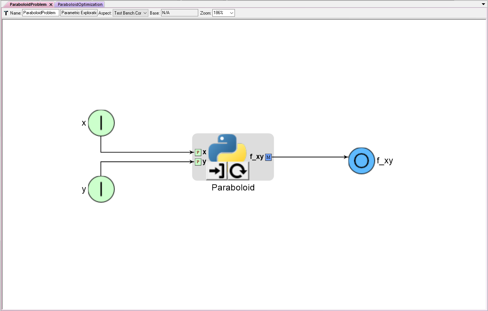
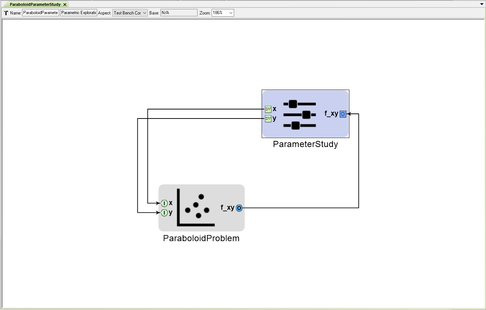

# ParaboloidParameterStudy

#### Here's an OpenMETA PET 'ParaboloidProblem' that contains a single PythonWrapper Component 'Paraboloid'


* Two Problem Inputs 'x' and 'y' are connected to Paraboloid's Parameter ports 'x' and 'y' respectively. 
These Problem Inputs each create IndepVarComps `p1` and `p2` and provide a mapping to `p1.x` and `p2.y`.
* Paraboloid's Unknown port 'f_xy' is connected to a Problem Output 'f_xy' and provides a mapping to `Paraboloid.f_xy`
* ParaboloidProblem does not contain an explicit driver.


#### Here's an OpenMETA PET 'ParaboloidParameterStudy' that contains 'ParaboloidProblem'


* Notice that ParaboloidProblem's Problem Inputs and Problem Outputs are exposed as ports when it is placed inside another PET
* ParaboloidParameterStudy contains an Optimizer that drives `ParaboloidProblem.x` and `ParaboloidProblem.y` according to the output 
of `ParaboloidProblem.f_xy`


#### Here's an OpenMDAO script that expresses the desired behavior of this OpenMETA model
```python
from __future__ import print_function
from openmdao.api import IndepVarComp, Component, Problem, Group
from openmdao.api import FullFactorialDriver  # FullFactorialDriver driver
from openmdao.api import ExecComp  # 'Quick Component' - useful for creating constraints
from openmdao.api import SubProblem  # Allows for nested drivers - not currently supported in OpenMETA - Introduced in OpenMDAO v.1.7.2.
from openmdao.api import SqliteRecorder  # Recorder
import sqlitedict  
from pprint import pprint

# 'Paraboloid' Component
class Paraboloid(Component):
    ''' Evaluates the equation f(x,y) = (x-3)^2 +xy +(y+4)^2 - 3 '''

    def __init__(self):
        super(Paraboloid, self).__init__()
        
        self.add_param('x', val=0.0)
        self.add_param('y', val=0.0)
        
        self.add_output('f_xy', shape=1)
        
    def solve_nonlinear(self, params, unknowns, resids):
        ''' f(x,y) = (x-3)^2 + xy + (y+4)^2 - 3 '''
        
        x = params['x']
        y = params['y']
        
        unknowns['f_xy'] = (x-3.0)**2 + x*y + (y+4.0)**2 - 3.0
        
if __name__ == '__main__':

    # Instantiate a sub-level Problem 'paraboloidProblem'.
    # Instantiate a Group and add it to paraboloidProblem.
    paraboloidProblem = Problem()
    paraboloidProblem.root = Group()
    
    # Add the 'Paraboloid' Component to paraboloidProblem's root Group.
    paraboloidProblem.root.add('Paraboloid', Paraboloid())
    
    # Initialize x and y values in seperate IndepVarComps and add them to paraboloidProblem's root group
    # These are added for the two Problem Inputs 'x' and 'y'
    paraboloidProblem.root.add('p1', IndepVarComp('x', 0.0))
    paraboloidProblem.root.add('p2', IndepVarComp('y', 0.0))
    
    # Connect the IndepVarComps 'p1.x' and 'p2.y' to 'T.Paraboloid.x' and 'T.Paraboloid.y' respectively
    paraboloidProblem.root.connect('p1.x', 'Paraboloid.x')
    paraboloidProblem.root.connect('p2.y', 'Paraboloid.y')

    # Paraboloid has no explicitly declared driver
    
    
    # Instantiate a top-level Problem 'ParaboloidParameterStudy'
    # Instantiate a Group and add it to ParaboloidParameterStudy
    ParaboloidParameterStudy = Problem()
    ParaboloidParameterStudy.root = Group()
    
    # Initialize x and y as IndepVarComps and add them to ParaboloidParameterStudy's root group
    ParaboloidParameterStudy.root.add('p1', IndepVarComp('x', 0.0)) 
    ParaboloidParameterStudy.root.add('p2', IndepVarComp('y', 0.0)) 
    
    # Add paraboloidProblem to ParaboloidParameterStudy as a SubProblem called 'ParaboloidProblem' 
    # Include paraboloidProblem's Problem Inputs and Problem Outputs in 'params' and 'unknowns' fields SubProblem 
    ParaboloidParameterStudy.root.add('ParaboloidProblem', SubProblem(paraboloidProblem, params=['p1.x', 'p2.y'],
                                            unknowns=['Paraboloid.f_xy']))  # This is where you designate what to expose to the outside world
    
    # Connect ParaboloidParameterStudy's IndepVarComps to ParaboloidProblem's params
    ParaboloidParameterStudy.root.connect('p1.x', 'ParaboloidProblem.p1.x')
    ParaboloidParameterStudy.root.connect('p2.y', 'ParaboloidProblem.p2.y')
    
    # Add driver
    ParaboloidParameterStudy.driver = FullFactorialDriver(num_levels=11)
    
    # Add design variables, objective, and constraints to the parameter study driver
    ParaboloidParameterStudy.driver.add_desvar('p1.x', lower=-50, upper=50)
    ParaboloidParameterStudy.driver.add_desvar('p2.y', lower=-50, upper=50)
    ParaboloidParameterStudy.driver.add_objective('ParaboloidProblem.Paraboloid.f_xy')
    
    
    # Data collection
    recorder = SqliteRecorder('record_results')
    recorder.options['record_params'] = True
    recorder.options['record_metadata'] = True
    ParaboloidParameterStudy.driver.add_recorder(recorder)
    
    # Setup
    ParaboloidParameterStudy.setup(check=False)
    
    # Run 
    ParaboloidParameterStudy.run()
    
    # Cleanup
    ParaboloidParameterStudy.cleanup()
    
    # Data retrieval & display
    # Old way - good for debugging IndepVars
    db = sqlitedict.SqliteDict( 'record_results', 'iterations' )
    db_keys = list( db.keys() ) # list() needed for compatibility with Python 3. Not needed for Python 2
    for i in db_keys:
        data = db[i]
        print('\n')
        print(data['Unknowns'])
        print(data['Parameters'])
```
#### Results:  
Run `paraboloid_parameterstudy_v1.py`