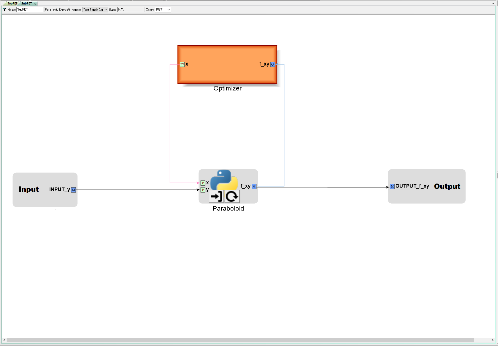
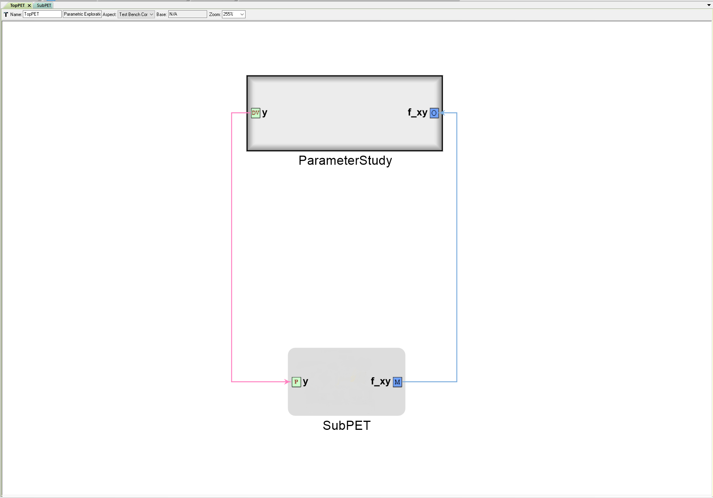

# Mockup Example #1 for Proposed PET Changes
This is a rough mockup of how the proposed PET changes might look at the GME, mdao_config.json, and OpenMDAO levels.

#### Here's an OpenMETA PET 'Sub' that has an Optimizer connected to a single PythonWrapper Component:


#### This PET has an 'Input' and 'Output' block that allow values to be received and sent to the 'outside world'. We propose that the 
'Input' block contain an IndepVarComp and the 'Output' block provide a simple mapping to the internal output that is connected to it 
(mapping the output of a component to an 'Output' block exposes that output if that PET is added into another PET via SubProblem - 
it get's added to SubProblem's list of unknowns).

#### Here's an OpenMETA PET 'Top' that contains 'Sub' as a SubProblem:


#### Here's some psuedo JSON code `mockup_mdao_config.json` showing what the `mdao_config.json` file produced by 'Top' might look like:
  
  ```javascript
  {
  "components": {
  
    # NEW MOCKUP CODE
    # subproblems are components
    "SubPET":{ 
      "components": {
        "Paraboloid": {
          "parameters": {
            "y": {
              "source": [
                "Inputs",
                "INPUT_y"
              ]
            },
            "x": {
              "source": [
                "Optimizer",
                "x"
              ]
            }
          },
          "unknowns": {
            "f_xy": {}
          },
          "details": {
            "filename": "../../scripts/paraboloid.py"
          },
          "type": "run_mdao.python_component.PythonComponent"
        },
        "Inputs": {
          "parameters": {
            "INPUT_y": {
              "source":[
                #TBD - How do we best hook this up to the 'outside'?
              ]
            }
          },
          "unknowns": {
            "INPUT_y": {
            }
          },
          "details": null,
          "type": "IndepVarComp"
        }    
        "Outputs": {
          "parameters": {
          "OUTPUT_f_xy": {
            "source": [
              "Paraboloid",
              "f_xy"
            ]
          }
        },
        "unknowns": {}
        },
        "details": null,
        "type": #TBD - pointer to output for SubProblem declaration in higher level
      },
      "drivers": {
        "Optimizer": {
          "type": "optimizer",
          "designVariables": {
            "x": {
              "RangeMin": -50.0,
              "RangeMax": 50.0
            }
          },
          "objectives": {
            "f_xy": {
              "source": [
                "Paraboloid",
                "f_xy"
              ]
            }
          },
          "constraints": {},
          "intermediateVariables": {},
          "details": {
            "Code": "",
            "CustomOptimizer": "",
            "OptimizationFunction": "COBYLA"
          }
        }
      },
      "recorders": [
        {
          "type": "DriverCsvRecorder",
          "filename": "output.csv",
          "include_id": true
        }
      ],
      "SelectedConfigurations": [
        "SubPET"
      ],
      "PETName": "/Testing/ParametricExploration/SubPET",
      "MgaFilename": "C:\\Users\\Joseph Coombe\\Documents\\openmeta-PET-changes\\openmeta-PET-changes.mga"
    }
	  # END OF NEW MOCKUP CODE
    
  },
  "drivers": {
    "ParameterStudy": {
      "type": "parameterStudy",
      "designVariables": {
        "y": {
          "RangeMin": -50.0,
          "RangeMax": 50.0
        }
      },
      "objectives": {
        "f_xy": {
          "source": [
            "SubPET",
            "f_xy"
          ]
        }
      },
      "constraints": {},
      "intermediateVariables": {},
      "details": {
        "Code": "num_samples=20",
        "SurrogateType": "None",
        "DOEType": "Full Factorial"
      }
    }
  },
  "recorders": [
    {
      "type": "DriverCsvRecorder",
      "filename": "output.csv",
      "include_id": true
    }
  ],
  "SelectedConfigurations": [
    "TopPET"
  ],
  "PETName": "/Testing/ParametricExploration/TopPET",
  "MgaFilename": "C:\\Users\\Joseph Coombe\\Documents\\openmeta-PET-changes\\openmeta-PET-changes.mga"
}
  ```
  
#### Here are two OpenMDAO scripts that express the desired functionality of this example

#### Version #1:
```python
from __future__ import print_function
from openmdao.api import IndepVarComp, Component, Problem, Group
from openmdao.api import ScipyOptimizer  # Optimizer driver
from openmdao.api import FullFactorialDriver  # FullFactorialDriver driver
from openmdao.api import ExecComp  # 'Quick Component' - useful for creating constraints
from openmdao.api import SubProblem  # Allows for nested drivers - not currently supported in OpenMETA - Introduced in OpenMDAO v.1.7.2.
from openmdao.api import SqliteRecorder  # Recorder
import sqlitedict  
from pprint import pprint

# First, let's create the component defining our system. We'll call it 'Paraboloid'.
class Paraboloid(Component):
    ''' Evaluates the equation f(x,y) = (x-3)^2 +xy +(y+4)^2 - 3 '''

    def __init__(self):
        super(Paraboloid, self).__init__()
        
        self.add_param('x', val=0.0)
        self.add_param('y', val=0.0)
        
        self.add_output('f_xy', shape=1)
        
    def solve_nonlinear(self, params, unknowns, resids):
        ''' f(x,y) = (x-3)^2 + xy + (y+4)^2 - 3 '''
        
        x = params['x']
        y = params['y']
        
        unknowns['f_xy'] = (x-3.0)**2 + x*y + (y+4.0)**2 - 3.0
        
if __name__ == '__main__':

    # Instantiate a sub-level Problem 'sub'.
    # Instantiate a Group and add it to sub
    sub = Problem()
    sub.root = Group()
    
    # Add the 'Paraboloid Component' to sub's root Group. Alternatively, I could have placed the 'Paraboloid' Component within a group
    sub.root.add('P', Paraboloid())
    
    # Initialize x and y values in seperate IndepVarComps and add them to sub's root group
    sub.root.add('p1', IndepVarComp('x', 13.0))
    sub.root.add('p2', IndepVarComp('y', -14.0))
    
    # Define a constraint equation and add it to top's root Group
    sub.root.add('con', ExecComp('c = x - y'))
    
    # Connect 'p1.x' and 'p2.y' to 'con.x' and 'con.y' respectively
    sub.root.connect('p1.x', 'con.x')
    sub.root.connect('p2.y', 'con.y')
    
    # Connect the IndepVarComps 'p1.x' and 'p2.y' to 'T.Paraboloid.x' and 'T.Paraboloid.y' respectively
    sub.root.connect('p1.x', 'P.x')
    sub.root.connect('p2.y', 'P.y')

    # Instantiate sub's optimization driver
    sub.driver = ScipyOptimizer()
    
    # Modify the optimization driver's settings
    sub.driver.options['optimizer'] = 'COBYLA'  # Type of Optimizer. 'COBYLA' does not require derivatives
    sub.driver.options['tol'] = 1.0e-4  # Tolerance for termination. Not sure exactly what it represents. Default: 1.0e-6
    sub.driver.options['maxiter'] = 200  # Maximum iterations. Default: 200
    sub.driver.opt_settings['rhobeg'] = 1.0  # Initial step size. Default: 1.0
    #sub.driver.opt_settings['catol'] = 0.1  # Absolute tolerance for constraint violations
    
    # Add design variables, objective, and constraints to the optimization driver
    sub.driver.add_desvar('p1.x', lower=-50, upper=50)
    sub.driver.add_objective('P.f_xy')
    sub.driver.add_constraint('con.c', lower=15.0)
    sub.driver.add_constraint('p1.x', lower=-50.0, upper=50.0)  # Note adding this while this variable constraint reduces the degree to which
                                                                # the constraint is violated, it does not eliminate the violation
    # ^ Jonathan comments that you often have to add constraints for the design variable ranges since the design variable bounds
    # are either not passed along to SciPy or are not enforced.    
    
    # Instantiate a top-level Problem 'top'
    # Instantiate a Group and add it to sub
    top = Problem()
    top.root = Group()
    
    # Initialize y as IndepVarComp and add it to top's root group
    top.root.add('p2', IndepVarComp('y', -14.0)) 
    
    # Add Problem 'sub' to 'top' as a SubProblem
    top.root.add('subprob', SubProblem(sub, params=['p2.y'],
                                            unknowns=['P.f_xy']))  # This is where you designate what to expose to the outside world
    
    # Connect top's IndepVarComps to SubProblem's params
    top.root.connect('p2.y', 'subprob.p2.y')
    
    # Add driver
    top.driver = FullFactorialDriver(num_levels=20)
    
    # Add design variables, objective, and constraints
    top.driver.add_desvar('p2.y', lower=-50, upper=50)

    # Data collection
    recorder = SqliteRecorder('record_results')
    recorder.options['record_params'] = True
    recorder.options['record_metadata'] = True
    top.driver.add_recorder(recorder)
    
    # Setup
    top.setup(check=False)
    
    # Run 
    top.run()
    
    # Cleanup
    top.cleanup()
    
    # Data retrieval & display
    # Old way - good for debugging IndepVars
    db = sqlitedict.SqliteDict( 'record_results', 'iterations' )
    db_keys = list( db.keys() ) # list() needed for compatibility with Python 3. Not needed for Python 2
    for i in db_keys:
        data = db[i]
        print('\n')
        print(data['Unknowns'])
        print(data['Parameters'])
```

#### Version #2:
```python
from __future__ import print_function
from openmdao.api import IndepVarComp, Component, Problem, Group
from openmdao.api import ScipyOptimizer  # Optimizer driver
from openmdao.api import FullFactorialDriver  # FullFactorialDriver driver
from openmdao.api import ExecComp  # 'Quick Component' - useful for creating constraints
from openmdao.api import SubProblem  # Allows for nested drivers - not currently supported in OpenMETA - Introduced in OpenMDAO v.1.7.2.
from openmdao.api import SqliteRecorder  # Recorder
import sqlitedict  
from pprint import pprint

# First, let's create the component defining our system. We'll call it 'Paraboloid'.
class Paraboloid(Component):
    ''' Evaluates the equation f(x,y) = (x-3)^2 +xy +(y+4)^2 - 3 '''

    def __init__(self):
        super(Paraboloid, self).__init__()
        
        self.add_param('x', val=0.0)
        self.add_param('y', val=0.0)
        
        self.add_output('f_xy', shape=1)
        
    def solve_nonlinear(self, params, unknowns, resids):
        ''' f(x,y) = (x-3)^2 + xy + (y+4)^2 - 3 '''
        
        x = params['x']
        y = params['y']
        
        unknowns['f_xy'] = (x-3.0)**2 + x*y + (y+4.0)**2 - 3.0
        
class Sub(Problem):
    def __init__(self):
        super(Sub, self).__init__()
        
        self.root = Group()
        
        # Add the 'Paraboloid Component' to sub's root Group. Alternatively, I could have placed the 'Paraboloid' Component within a group
        self.root.add('P', Paraboloid())
        
        # Initialize x and y values in seperate IndepVarComps and add them to sub's root group
        self.root.add('p1', IndepVarComp('x', 13.0))
        self.root.add('p2', IndepVarComp('y', -14.0))
        
        # Define a constraint equation and add it to top's root Group
        self.root.add('con', ExecComp('c = x - y'))
        
        # Connect 'p1.x' and 'p2.y' to 'con.x' and 'con.y' respectively
        self.root.connect('p1.x', 'con.x')
        self.root.connect('p2.y', 'con.y')
        
        # Connect the IndepVarComps 'p1.x' and 'p2.y' to 'T.Paraboloid.x' and 'T.Paraboloid.y' respectively
        self.root.connect('p1.x', 'P.x')
        self.root.connect('p2.y', 'P.y')

        # Instantiate sub's optimization driver
        self.driver = ScipyOptimizer()
        
        # Modify the optimization driver's settings
        self.driver.options['optimizer'] = 'COBYLA'  # Type of Optimizer. 'COBYLA' does not require derivatives
        self.driver.options['tol'] = 1.0e-4  # Tolerance for termination. Not sure exactly what it represents. Default: 1.0e-6
        self.driver.options['maxiter'] = 200  # Maximum iterations. Default: 200
        self.driver.opt_settings['rhobeg'] = 1.0  # Initial step size. Default: 1.0
        #sub.driver.opt_settings['catol'] = 0.1  # Absolute tolerance for constraint violations
        
        # Add design variables, objective, and constraints to the optimization driver
        self.driver.add_desvar('p1.x', lower=-50, upper=50)
        self.driver.add_objective('P.f_xy')
        self.driver.add_constraint('con.c', lower=15.0)
        self.driver.add_constraint('p1.x', lower=-50.0, upper=50.0)  # Note adding this while this variable constraint reduces the degree to which
                                                                    # the constraint is violated, it does not eliminate the violation
        # ^ Jonathan comments that you often have to add constraints for the design variable ranges since the design variable bounds
        # are either not passed along to SciPy or are not enforced.    
        
if __name__ == '__main__':

    
    # Instantiate a top-level Problem 'top'
    # Instantiate a Group and add it to sub
    top = Problem()
    top.root = Group()
    
    # Initialize y as IndepVarComp and add it to top's root group
    top.root.add('p2', IndepVarComp('y', -14.0)) 
    
    # Add Problem 'sub' to 'top' as a SubProblem
    top.root.add('subprob', SubProblem(Sub(), params=['p2.y'],
                                            unknowns=['P.f_xy']))  # This is where you designate what to expose to the outside world
    
    # Connect top's IndepVarComps to SubProblem's params
    top.root.connect('p2.y', 'subprob.p2.y')
    
    # Add driver
    top.driver = FullFactorialDriver(num_levels=20)
    
    # Add design variables, objective, and constraints
    top.driver.add_desvar('p2.y', lower=-50, upper=50)

    # Data collection
    recorder = SqliteRecorder('record_results')
    recorder.options['record_params'] = True
    recorder.options['record_metadata'] = True
    top.driver.add_recorder(recorder)
    
    # Setup
    top.setup(check=False)
    
    # Run 
    top.run()
    
    # Cleanup
    top.cleanup()
    
    # Data retrieval & display
    # Old way - good for debugging IndepVars
    db = sqlitedict.SqliteDict( 'record_results', 'iterations' )
    db_keys = list( db.keys() ) # list() needed for compatibility with Python 3. Not needed for Python 2
    for i in db_keys:
        data = db[i]
        print('\n')
        print(data['Unknowns'])
        print(data['Parameters'])
```

This is, of course, a very rough example. The actual `mdao_config.json` structure and `run_mdao.py` result (we don't even generate a
standalone OpenMDAO script in OpenMETA) will be determined by whoever updates CyPhy and runMDAO (probably Jonthan and Kevin).
